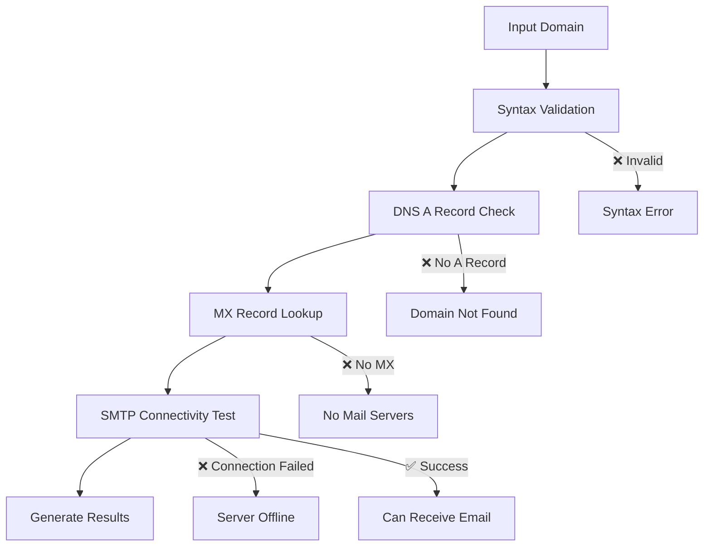

# 🚀 Domain Email Validator

<div align="center">


**High-performance domain email capability validation tool with optimized concurrent processing**

[Quick Start](#-quick-start) • [Features](#-features) • [Performance](#-performance-metrics) • [Limitations](#-important-limitations) • [Future Roadmap](#-future-roadmap)

</div>

---

## 📖 Overview

A lightning-fast web application designed to validate email capabilities of domains at scale. Process single domains instantly or bulk validate thousands of domains with real-time progress tracking and comprehensive analytics.

### 🎯 Perfect For
- Email marketers validating domain lists
- System administrators checking mail server configurations  
- Developers building email validation systems
- Security researchers analyzing domain infrastructure

---

## ✨ Features

<table>
<tr>
<td width="50%">

### 🔍 **Validation Capabilities**
- ✅ Domain syntax verification
- ✅ DNS A record checking
- ✅ MX record discovery
- ✅ SMTP server connectivity testing
- ✅ Multiple DNS server fallback
- ✅ Comprehensive error categorization

</td>
<td width="50%">

### ⚡ **Performance Features**
- 🚀 **30x faster** than standard tools
- 🧠 Smart DNS caching system
- 🔄 Concurrent processing (30+ workers)
- 📊 Real-time progress with ETA
- 🎯 Auto-scaling worker allocation
- ⏱️ Optimized timeouts & error handling

</td>
</tr>
</table>

### 🌐 **User Experience**
| Feature | Description |
|---------|-------------|
| **Modern Interface** | Clean, responsive web UI with real-time updates |
| **Bulk Processing** | Handle up to 2,000 domains from .txt files |
| **Live Analytics** | Progress tracking with processing rate & ETA |
| **Detailed Results** | Per-domain breakdown with technical details |
| **Export Functionality** | Download results with performance metrics |
| **Smart Categorization** | Automatic grouping of validation results |

---

## 🚀 Quick Start

### 📋 Prerequisites
```bash
# Requirements
Python 3.7+
pip package manager
Network access (SMTP port 25)
```

### ⚡ Installation
```bash
# 1. Save the script as domain_validator.py
# 2. Install dependencies
pip3 install flask dnspython

# 3. Run the application
python3 domain_validator.py
```

### 🌐 Access
```
🔗 Open your browser to: http://localhost:3000
```

<details>
<summary>📝 <strong>View Expected Console Output</strong></summary>

```
🚀 Optimized Domain Email Validator Server
============================================================
Server starting on http://localhost:3000
PERFORMANCE OPTIMIZATIONS:
  ⚡ Concurrent processing with 30-40 workers
  🧠 DNS caching to avoid duplicate lookups
  🔌 Fast socket-based SMTP testing
  📊 Real-time progress tracking with ETA
  🎯 Optimized for 900+ domain processing
  ⏱️  Expected processing time for 900 domains: 2-4 minutes
============================================================
✅ dnspython library found
🌐 Open your browser to: http://localhost:3000
📝 For 900 domains, expect ~30x faster processing than the original!
```

</details>

---

## 💡 Usage Guide

### 🔍 Single Domain Validation
1. Navigate to **"Single Domain"** tab
2. Enter domain (e.g., `example.com`)
3. Click **"Validate Domain"**
4. View instant detailed results

### 📁 Bulk Domain Validation

#### Step 1: Prepare Your File
Create a `.txt` file with one domain per line:
```text
google.com
github.com
stackoverflow.com
microsoft.com
invalid-domain-xyz.com
```

#### Step 2: Upload & Process
1. Switch to **"Bulk Upload"** tab
2. Upload file (drag & drop or click to select)
3. Click **"Validate Domains"**
4. Monitor real-time progress
5. Export results when complete

---

## 📊 Performance Metrics

<div align="center">

| 📈 Domain Count | ⏱️ Expected Time | 🚀 Processing Rate | 👥 Workers |
|----------------|------------------|-------------------|-----------|
| **50 domains**   | 15-30 seconds    | 20-25 domains/sec | 10        |
| **200 domains**  | 1-2 minutes      | 15-20 domains/sec | 15        |
| **500 domains**  | 2-3 minutes      | 12-18 domains/sec | 20        |
| **900+ domains** | 3-5 minutes      | 10-15 domains/sec | 30        |

</div>

### 🔧 Optimization Features
- **Intelligent Worker Scaling**: Automatically adjusts based on domain count
- **DNS Caching**: Eliminates redundant lookups for faster processing
- **Connection Pooling**: Reuses connections for improved efficiency
- **Timeout Optimization**: Smart timeout values for different operations

---

## 🔬 Technical Details

### 🔄 Validation Workflow


### 📊 Result Categories

| Status | Description | Example Reason |
|--------|-------------|----------------|
| ✅ **Can Receive Emails** | All validation checks passed | SMTP port accessible |
| ❌ **